# PrusaConnect ESP32-CAM

For Web cameras in the PrusaConnect is launched a WEB page on the Android/IOS/laptop device, which then sending photos from the camera to the prusaconnect backend.

Here is the implementation of a WEB camera for prusa connect, where the ESP32-CAM board is programmed in the arduino IDE as a WEB camera via WI-FI.

What we need for functionality
- ESP32-CAM AI-thinker board with OV2640 camera module [ here ](#esp32)
- Arduino IDE
- Install the necessary libraries in the Arduino IDE [ here ](#arduino)
- Get Token ID and Fingerprint from new camera in the PrusaConnect [ here ](#token_finger)
- Get an ISRG Root X1 certificate for the PrusaConnect site [ here ](#cert)
- How to configure [ESP32_PrusaConnectCam_web](https://github.com/johnyHV/PrusaConnect_ESP32-CAM/tree/master/ESP32_PrusaConnectCam_web) SW with WEB interface [ here ](#mcu_web)

<a name="esp32"></a>
## ESP32-CAM AI-thinker board 
It's few dolars board with **ESP32** MCU and Camera. It's neccesary buy board with **camera module OV2640**. the board is sold without a programmer as standard. It is possible to program it using the FTDI USB to UART converter, or buy an original programmer for the board. I recommend buying a programmer for the board. It can save a lot of trouble with connecting and programming the board.

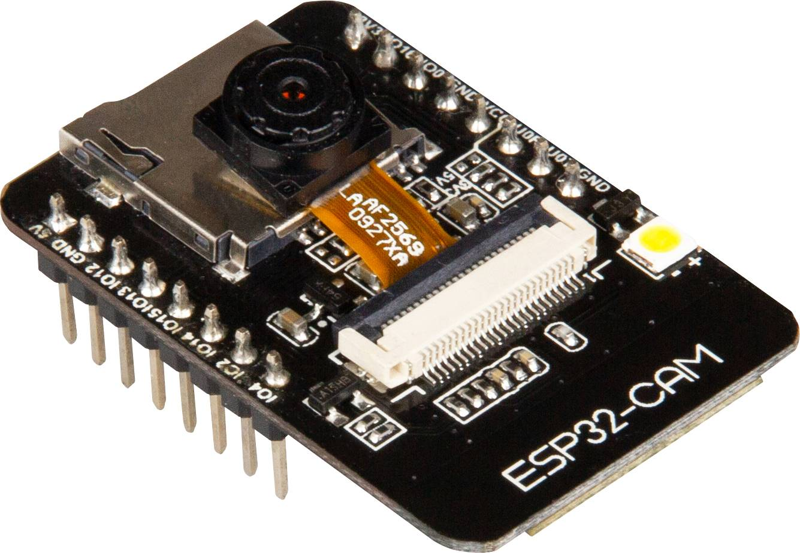

In the next picture we can see **ESP32-CAM** board and programator for board. Currently price for **ESP32-CAM** board with programmer is 6eur with shippig from aliexpress.


You must have a camera version **OV2640**. in the case of a different camera, it is necessary to modify the camera's pinout, and some camera settings may not work correctly

<a name="arduino"></a>
## Necessary libraries in the Arduino IDE
On the Internet there are many good instructions on how to install libraries and support for the ESP-32 board to Arduino IDE. So I will describe it only briefly.

At the first step we need install to Arduino IDE support for ESP32 board. **file-> preferences -> additional boards managers URLs**
 ```
 https://raw.githubusercontent.com/espressif/arduino-esp32/gh-pages/package_esp32_index.json
 ```
 then go to **Tools -> Board -> Boards Manager...** and install module **ESP32** by **Espressif Systems**

Then we can select board version **Tools -> Board -> ESP32 Arduino -> AI Thinker ESP32**

Next step is install necessary libraries. Go to **Sketch -> Include library -> Manage Libraries...** or you can use **ctrl+shift+i** then is possible search necessary libraries, and installed their

**Apps/module/library versions used for development**
- App [Arduino IDE 1.8.19](https://www.arduino.cc/en/software)
- MCU support [ESP32 2.0.11](https://github.com/espressif/arduino-esp32)
- Library [ESPAsyncWebSrv 1.2.6](https://github.com/dvarrel/ESPAsyncWebSrv)
- Library [AsyncTCP 1.1.4](https://github.com/dvarrel/AsyncTCP)
- Library [UniqueID 1.1.3](https://www.arduino.cc/reference/en/libraries/arduinouniqueid/)

<a name="token_finger"></a>
## How to get a token ID
**Step 1.** Go to [PrusaConnect WEB page](https://connect.prusa3d.com/) . Then in the **left side** click to **Cameras**. Then Prusa now have two buttons **"ADD NEW WEB CAMERA"** and **"Add new other camera"**. We need use button **"Add new other camera"**

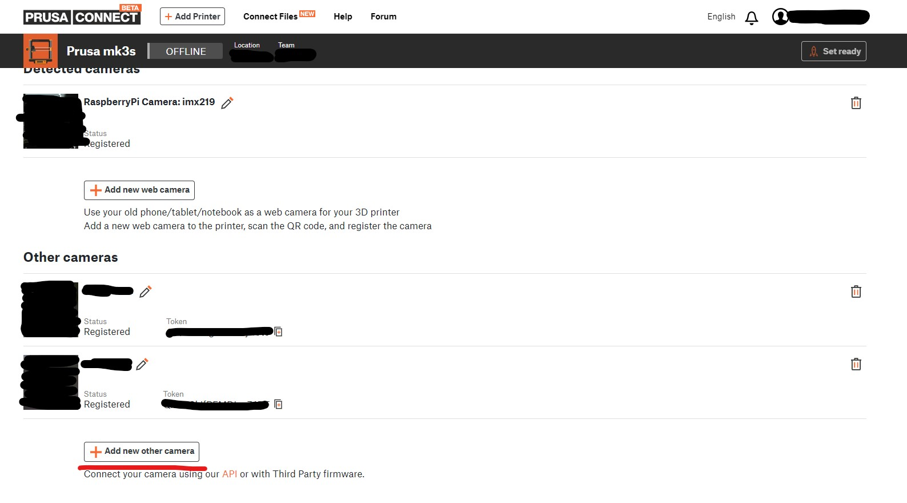

**Step 2.** Prusa now automatically generated just **token**. **Fingerprint** is generated on the camera devices. So just copy the **token** and paste it on the web page of the camera. 


<a name="cert"></a>
## ISRG Root X1 certificate for the PrusaConnect site
Currently the source code contains the correct certificate. Well, in a few steps I will show you how to get an ISRG Root X1 certificate if necessary.

Go to site [PrusaConnect camera](https://webcam.connect.prusa3d.com) and click on the **lock**

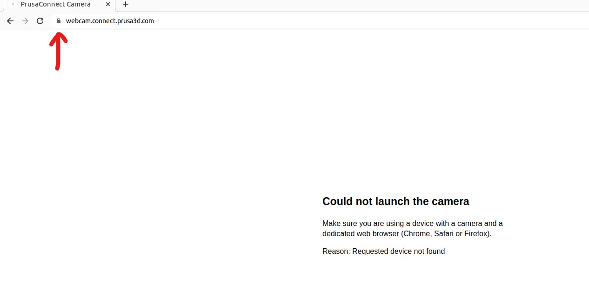

then go to **"Connection is secure"**

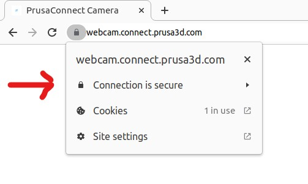

and **"Certificate is valid"**

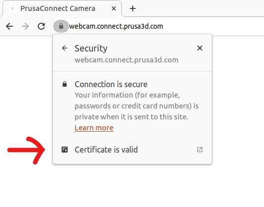

click on the tab **"Details"**

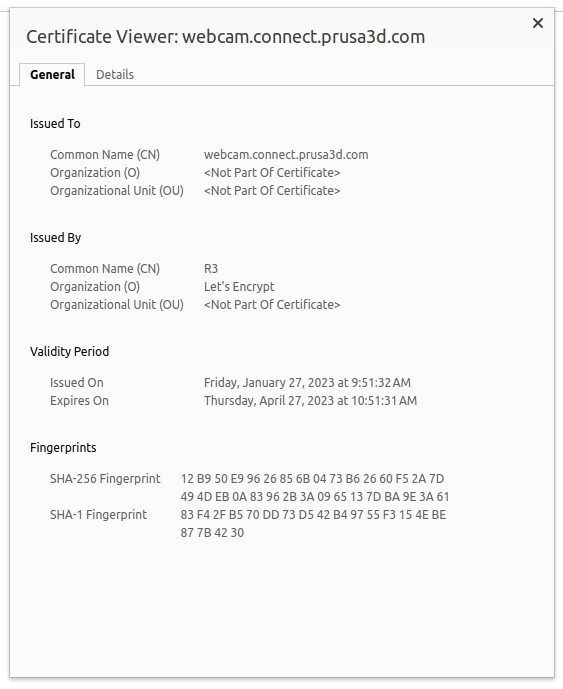

Here we can see ISRG Root X1. Please click to the first line **"BuiltIn Object Token: ISRG Root X1"**, click to the **"Export"** and save certificate to the hard drive.

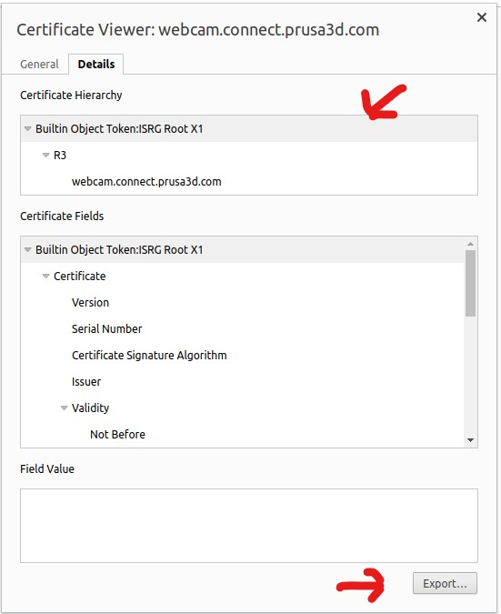

Now we can open the certificate in a text editor and save it in the source code

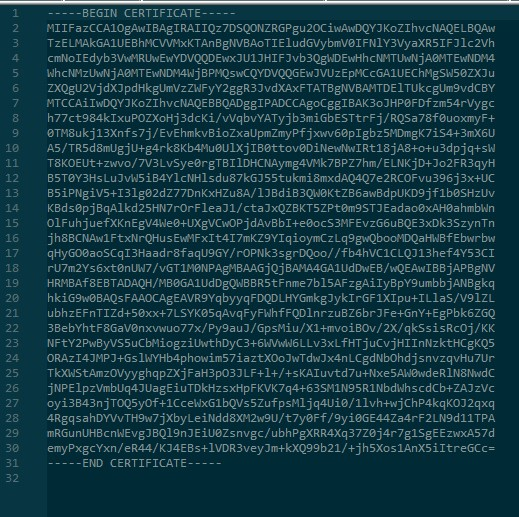

<a name="mcu_web"></a>
## How to configure MCU with WEB interface
Board version is **Tools -> Board -> ESP32 Arduino -> AI Thinker ESP32**. In the source code we can see several variable

This SW version use **WEB interface** for settings **token** variable. And there is an added option to turn **on/off the LED** using the WEB page. All variables is stored in the internal **FLASH memory**. 

- change the WI-FI ssid and password for WI-FI (line 30 and 31 on the file ESP32_PrusaConnectCam_web.ino). 
  Here is example for WiFi configuration, where WiFi network name (SSID) is HomeNetwork and password is 12345678
```
const char* ssid     =      "HomeNetwork";
const char* password =      "12345678";
```
- compile the code and upload it to the MCU
- open the serial console and wait until the IP address of the WEB server is displayed

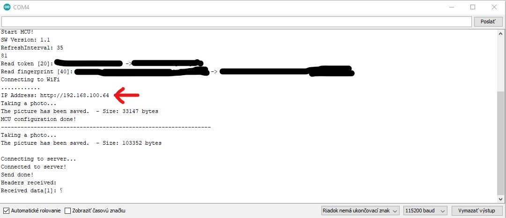

- now you can go to the WEB page and set the token and fingerprint. On the root page it's possible configuration camera parameters like as photo quality, photo size, photo vertical flip or horizontal mirror and so on

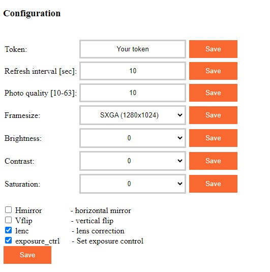

- the page also shows the current MCU configuration. The configuration is stored in the internal memory of the MCU

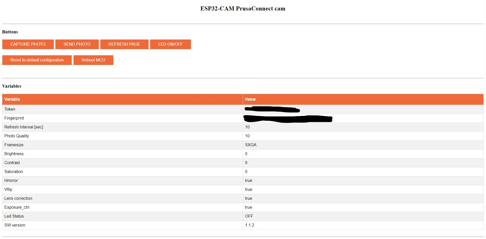

# Changelog
- 6.11.2023 - added checkbox to turn on and off the automatic picture taking.
- 24.2.2023 - Init repository
- 25.2.2023 - added **ESP32_PrusaConnectCam** app **version 1.0** (the source code is not optimal, but it is functional)
- 25.2.2023 - added documentation
- 27.2.2023 - added version of the application with WEB interface for MCU configuration **ESP32_PrusaConnectCam_web**. app **version 1.1**
- 6.4.2023  - added several parameters for camera configuration for **ESP32_PrusaConnectCam_web**. app **version 1.1.2**
- 6.4.2023  - fix issue with default configuration, added RSSI information on the root WEB page about signal quality for **ESP32_PrusaConnectCam_web**. app **version 1.1.3**
- 16.9.2023 - Prusa has officially released the possibility of generating a token for a camera with an official API. This version has implemented compatibility with the official Prusa API. Added detection of the first MCU start, and fingerprint generation. **WARNING! Before uploading this SW version to the MCU, please back up your configuration. This version clear currently saved configuration in the MCU!** app **version 1.1.4**
- 16.9.2023 - added mDNS record http://prusa-esp32cam.local **version 1.1.5**
- 2.11.2023 - added Camera flash functionality, and added auto reconnect to WiFi after connection lost
  
# TO-DO
- add additional parameters for camera configuration
