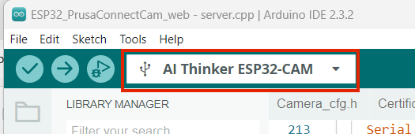
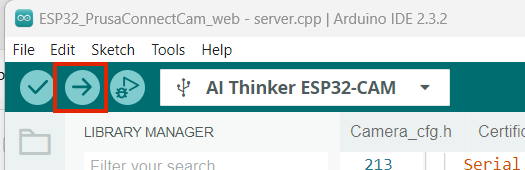

# PrusaConnect ESP32-CAM

**Update 2024-04-15**

This is an implementation of a ESP32-CAM camera for PrusaConnect, programmed via the Arduino IDE. 
This sketch uses the ESP32 CAM to record pictures for
- display on a wifi-local browser via built-in web server (i.e., computer/Android/IOS browser).
- sending pictures to PrusaConnect in the cloud.


What we need for the functionality
- ESP32-CAM AI-thinker board with OV2640 camera module [ here ](#esp32)
- Arduino IDE
- Install the necessary libraries in the Arduino IDE [ here ](#arduino)
- Get PrusaConnect API Token ID and Fingerprint for a newly created camera  [ here ](#token_finger)
- Get an ISRG Root X1 certificate for the PrusaConnect site [ here ](#cert)
- How to configure [ESP32_PrusaConnectCam_web](https://github.com/johnyHV/PrusaConnect_ESP32-CAM/tree/master/ESP32_PrusaConnectCam_web) SW with WEB interface [ here ](#mcu_web)
- Link for 3D model to camera holder [ here ](https://www.printables.com/cs/model/743292-esp32-cam-holder)
- Schematic main board is [here](#schematic)
- Different main board version [here](#different_mcu)
- Issue with LED on the main board [here](#led_issue)
- External WiFi antenna [here](#ext_wifi)

For more information on the ESP32-CAM see here:  
https://randomnerdtutorials.com/program-upload-code-esp32-cam/  
https://www.diyengineers.com/2023/04/13/esp32-cam-complete-guide/

## Accessing PrusaConnect

To send images to PrusaConnect we need three items:

- An API token, a unique PrusaConnect ID, used by the Prusa account for this camera. This token is issued by PrusaConnect (on request) and is used to identify the camera when we upload the image to PrusaConnect. PrusaConnect must give us this information (when we request to register the camera).
 
- The ISRG Root X1 certificate for the PrusaConnect site. We have a copy of this certificate embedded in the code.  During runtime, when connecting to the cloud (PrusaConnect) server provides its root certificate and we can check our stored certificate against the server's certificate to know we are connecting to the trusted server.  PrusaConnect must give us this information (from its server).

- A locally calculated fingerprint that identifies the camera uniquely. We don't have to worry too much about this: tThe Arduino compiler provides a unique random number and attaches the ESP23CAM MAC address at the end. Not sure if this is used anywhere and for what purpose.


---------------------------------------

<a name="token_finger"></a>
### How to get the PrusaConnect API token for our camera (camera ID in PrusaConnect).

1.  Go to [PrusaConnect WEB page](https://connect.prusa3d.com/) and open the dashboard for the printer that will be using the camera.

1. The dashboard shows a number of 'tabs' just below the black printer ID bar. Click on the 'camera' tab.


1. There are two boxes where you can add a new camera. The first option is to add a web-exposed mobile phone or computer camera. The second option is to add 'other' camera. We want to add an 'other' camera. So click on `+Add new other camera`.

.

1. PrusaConnect will now create a new API token, by which to identify the new camera. The token is currently allocated to `Unnamed Camera`.      You can name the camera by clicking on the pencil next to `Unnamed Camera` and give it the name you want to use.

    Copy the token and store in a safe place, because you will upload it to the camera later. 

    The picture below shows my previously added PrusaConnect_ESP32-CAM camera and also the new token.  You can add as many cameras for each printer that you want.  You can even have cameras mounted on other printers  (e.g., a MKS3+ with no wifi) or looking into the room.


1. The PrusaConnect web server uses an ISRG Root X1 certificate to identify itself. We need this when building the camera software, to ensure that the camera client software handshakes properly with the PrusaConnect server.

    The certificate text at the time this was written is already stored in the `certificate.h`file.  The certificate has limited lifetime, so if you need to update to a new certificate, download as shown below and paste into `certificate.h`.

    Visit [PrusaConnect camera](https://webcam.connect.prusa3d.com) and click on the 'View site information' button. This could be a small lock or slider/shield shown on the following two pictures (it depends on the browser you are using):


1. Then click on `Connection is secure` or the equivalent text:


1. Then click on `Certificate is valid` or the equivalent text:


1. Next click on the `Details` tab, where we can see ISRG Root X1. Please click on the `ISRG Root X1` entry under `Certificate Hierarchy`, and next click on the `Export`button on the bottom of the dialog box to save the certificate to your computer:


1. Now we can open the certificate in a text editor and save it in the source code file `certificate.h`.  You can check the certificate text, it may already be in the file.


<a name="arduino"></a>
## Arduino IDE and necessary libraries

**Update 2024-04-15: Using Arduino IDE 2.3.2**


- [Arduino IDE 2.3.2](https://www.arduino.cc/en/software). Download and install the IDE.
- Add ESP32 support [ESP32 2.0.15](https://github.com/espressif/arduino-esp32). 
  - *file-> preferences -> additional boards managers URLs* and add this link near the bottom of the dialog box:  
  `https://raw.githubusercontent.com/espressif/arduino-esp32/gh-pages/package_esp32_index.json`
  - Go to *Tools -> Board -> Boards Manager...* and install module **ESP32** by Espressif Systems.

- Select board version: *Tools -> Board -> ESP32 Arduino -> AI Thinker ESP32*
- Install the following libraries, via *Sketch -> Include library -> Manage Libraries...*:
  - [ESPAsyncWebSrv 1.2.7](https://github.com/dvarrel/ESPAsyncWebSrv)  by dvarrel.  
  <font color="red">**Note:** [ESPAsyncWebServer](https://github.com/lacamera/ESPAsyncWebServer) by lacamera clashes with dvarrel's library, if it is already installed, it must be uninstalled.</font>
  - [AsyncTCP 1.1.4](https://github.com/dvarrel/AsyncTCP)  by dvarrel. This might be automatically installed as a prerequisite by ESPAsyncWebSrv. If not please install.
  - [UniqueID 1.3.0](https://www.arduino.cc/reference/en/libraries/arduinouniqueid/) by Arduino.


<a name="softwarecompile"></a>
## Software changes and compilation

1. In the Arduino IDE open `ESP32_PrusaConnectCam_web`, in the folder where you cloned this repository.
1. Ensure that the ESP32 board is selected *Tools -> Board -> ESP32 Arduino -> AI Thinker ESP32-CAM*. 


    


1. Open `ESP32_PrusaConnectCam_web.ino` in the IDE and make set your wifi SSID and password (near line 30).   Here is example for WiFi configuration, where WiFi network name (SSID) is `HomeNetwork` and password is `12345678` (replace with your own!).
    ```
    const char* ssid     =      "HomeNetwork";
    const char* password =      "12345678";

    ```

1. If it is necessary to set the serial link baud rate, do so in the file `mcu_cfg.h` by setting the variable `SERIAL_PORT_SPEER` to whatever speed works for you.

1. Compile the code by clicking on the check mark:

    

    If the code compiles correctly, the output should be something like this:

        Sketch uses 1062121 bytes (33%) of program storage space. Maximum is 3145728 bytes.  
        Global variables use 52608 bytes (16%) of dynamic memory, leaving 275072 bytes for local variables. Maximum is 327680 bytes.

    If there are errors, try to fix these. You can only download code if there are no errors.


<a name="esp32"></a>
## ESP32-CAM AI-thinker board 
It's few dollars board with **ESP32** MCU and Camera. It's necessary buy board with **camera module OV2640**. the board is sold without a programmer as standard. It is possible to program it using the FTDI USB to UART converter, or buy an original programmer for the board. I recommend buying a programmer for the board. It can save a lot of trouble with connecting and programming the board.


In the next picture we can see **ESP32-CAM** board and programmer for board. Currently price for **ESP32-CAM** board with programmer is 6eur with shipping from aliexpress.


You must have a camera version **OV2640**. in the case of a different camera, it is necessary to modify the camera's pin-out, and some camera settings may not work correctly


<a name="schematic"></a>
Schematic for MCU board. You don't really need this to program the board, but it is a handy reference.


The board layout and pin naming:


<a name="different_mcu"></a>
## Programming the Different MCU versions

To connect the ESP32-CAM to your PC USB port you need a serial adapter because ESP32-CAM doesn't have an USB port. There are two different types of serial adapters (CH340 or FFT232RL/CP2102), which are not compatible with each other.  

There are very many different variations of ESP32 cameras and ESP32 boards, each working with one of the two different serial adapters.  The blue rectangle in the picture below shows only two of the different versions.

- Type 1 (12 pads) is programmed with the CH340.  The pin with the red arrow is used for MCU RESET (GND/R).  
- Type 2 (8 pads) is programmed with the FFT232RL or CP2102. The pin with the red arrow is used for ground (GND).  


## Programming Type 2 board with the Arduino IDE

1. Connect the ESP32-CAM to the FTDI232 using the following schema. 

    To prepare the ESP32-CAM for programming connect the GPIO 0 to GND (blue wire).

    

    

1.   If your FTDI232 has a jumper to set 3.3V or 5V set it to 5V.
    

2. Compile/Upload to the ESP32CAM board from inside Arduino IDE (the green right-arrow in the IDE):

    

    The downloading starts with something similar to this:

    

    and ends like this:  

    


3. Once the uploading is complete, you have to disconnect the GPIO 0 from the GND (blue wire).


1. Open the serial monitor in the IDE:

    

1. Restart the device, by power cycle or pressing the RST button. It will show something like this:

    

<a name="mcu_web"></a>
## Configure ESP32-CAM with the browser interface

Every ESP32-CAM must be set up to work with PrusaConnect.  This is done via the web server that is running on the ESP32-CAM; it serves a web page that can be accessed by any browser.  The settings made via the web page is stored in the internal FLASH memory and will be remembered after power down. 

1. Open the serial console and wait until the ESP32-CAM IP address is displayed

    

1. Open a browser on your PC and enter the IP address of the ESP32-CAM. This will then serve the web page to your PC.

1. The page shows the current MCU configuration. The configuration is stored in the internal memory of the MCU.

    

1. It is possible to set the configuration camera parameters such as photo quality, photo size, photo vertical flip or horizontal mirror and so on:

    


1. You must tell the ESP32-CAM by which ID  API token variable it will be known to PrusaConnect. Enter the API token you downloaded from the PrusaConnect website into the first entry `Token` and press `Save`.

    


1. There is also an option to turn the LED on or off (but see the write-up below).

Once the API token value is saved on the ESP32-CAM, the images should be displayed in the ESP32-CAM web page and should also be uploaded to the PrusaConnect web site.

<a name="led_issue"></a>
## LED issue
The board have problem with LED for FLASH. LED don't have any current limitation. So with frequent use it goes corrupted due to too high current flowing through it.

Currently I know only the following solutions this issue. 

1.  Connecting an external LED via relay/transistor/mosfet to board as on the next picture:
    

2. Use a LED Chip-on-Board (COB), where there are two options:
    -  Desolder the original LED. I used COB board from simple USB LED lamp. Transistor have current limitation 500mA, and my USB lamp have current consumption 180mA, so it's OK. 


        This is my USB lamp
        

        I desoldered original LED from board
        

        It's necessary clean pads after desoldering original LED
        

        Then is possible use USB LED lamp +5V pin, and minus pole from original LED
        

        Then stick it to the box using double-sided tape 
        


    - Don't remove the original LED from the board, but just solder minus wire from COB LED or USB LED Lamp to transistor collector. Plus wire is necessary soldering to +5V. Original LED have current consumption 30-40mA, and USB lamp have current consumption approximately 180mA. After calculation, it is approximately 220mA, which is still fine.


        

  1. I thought about how to solder a resistor to the LED for current limitation. It would be possible, but for casual users it can be difficult, due to lack of space. This is more simple solution.

      I tried use resistor for original LED. At first step is necessary desoldering transistor collector from the PCB and lift the transistor into the air. Then is possible soldering resistor between the collector of the transistor and the PCB. I used resistor in the case 0603 with value 10-12ohm.

      

<a name="ext_wifi"></a>
## External/internal WiFi antenna'

The EPS32-CAM has an onboard antenna, which should work for most cases. You can also use an external antenna but changing the jumper as shown below and plugging an antenna to the connector.


# Changelog
- 24.2.2023 - Init repository
- 25.2.2023 - added **ESP32_PrusaConnectCam** app **version 1.0** (the source code is not optimal, but it is functional)
- 25.2.2023 - added documentation
- 27.2.2023 - added version of the application with WEB interface for MCU configuration **ESP32_PrusaConnectCam_web**. app **version 1.1**
- 6.4.2023  - added several parameters for camera configuration for **ESP32_PrusaConnectCam_web**. app **version 1.1.2**
- 6.4.2023  - fix issue with default configuration, added RSSI information on the root WEB page about signal quality for **ESP32_PrusaConnectCam_web**. app **version 1.1.3**
- 16.9.2023 - Prusa has officially released the possibility of generating a token for a camera with an official API. This version has implemented compatibility with the official Prusa API. Added detection of the first MCU start, and fingerprint generation. **WARNING! Before uploading this SW version to the MCU, please back up your configuration. This version will clear/reset the currently saved configuration in the MCU!** app **version 1.1.4**
- 16.9.2023 - added mDNS record http://prusa-esp32cam.local **version 1.1.5**
- 2.11.2023 - added Camera flash functionality, and added auto reconnect to WiFi after connection lost
  
# TO-DO
- add additional parameters for camera configuration
